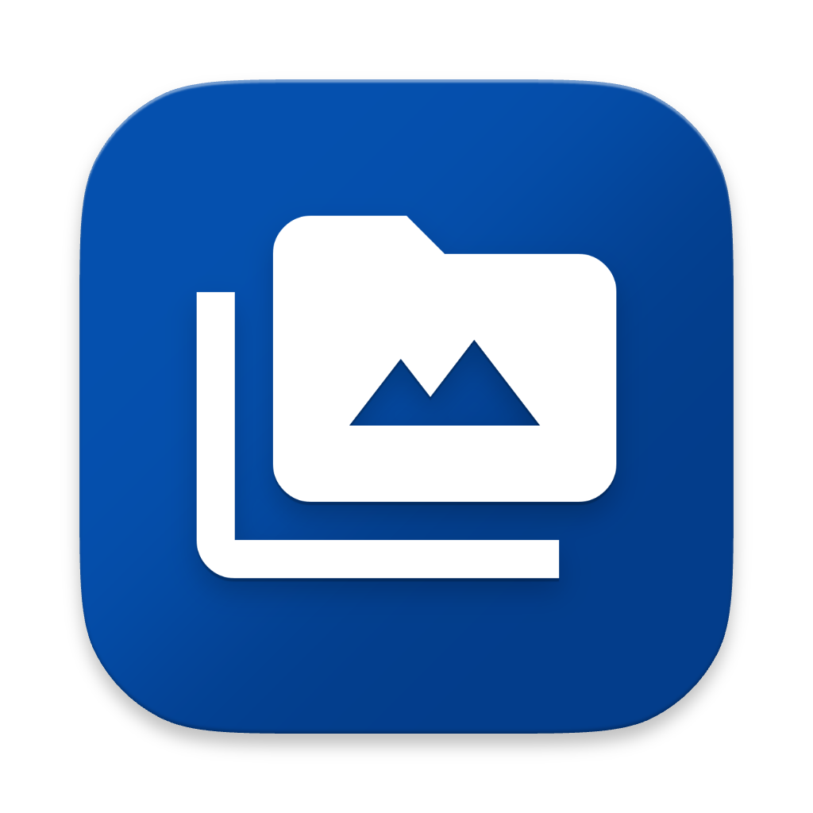

<div align="center">

  

  # Compressy

  **Batch image compression that never leaves your PC.**

  <p>
    
    
    
  </p>

  <p>
    <a href="https://compressy.app">Website</a> &middot;
    <a href="https://compressy.app/download">Download</a> &middot;
    <a href="https://compressy.app/benchmarks/">Benchmarks</a> &middot;
    <a href="https://compressy.app/examples/">Examples</a>
  </p>

</div>

---

Compressy is a fast, offline image compressor for Windows. Point it at a folder, pick a quality and output format, and shrink JPG, PNG, WebP, and AVIF files in one pass — powered by libvips running directly on your machine.

No uploads. No accounts. No cloud queue between you and a smaller file.

<!-- TODO: drop in a real app screenshot here once captured (e.g. docs/screenshot.png).
     The before/after strip below uses real assets from website/public/examples/. -->

<table align="center">
  <tr>
    <th width="50%">Original — 2.4 MB PNG</th>
    <th width="50%">Compressed — 132 KB WebP</th>
  </tr>
  <tr>
    <td align="center"></td>
    <td align="center"></td>
  </tr>
  <tr>
    <td colspan="2" align="center"><sub>Same image, quality 85 — <strong>&minus;94.6%</strong>. Both files ship in this repo, compressed by Compressy itself.</sub></td>
  </tr>
</table>

## Why Compressy

Online compressors want your photos uploaded to someone else's server — one at a time, behind file-size caps, accounts, and queue pages. Compressy is a small Windows utility that does the work on-device:

- **Local-first** — files never leave your machine. Compressy doesn't need an internet connection to compress.
- **Batch, not one-by-one** — select a folder, see size, type, and dimensions for every image, check exactly what to compress.
- **Real control** — quality 40–95, three engines (fast / balanced / max), lossless mode, metadata stripping, resizing, and format conversion.
- **Honest results** — per-file before/after savings, running totals, a CSV report, and automatic backups when overwriting originals.

## Features

| | |
|---|---|
| **Formats** | JPG, PNG, WebP, AVIF in — keep the original format or convert the whole batch to WebP, AVIF, or JPEG |
| **Engines** | Fast, Balanced, or Maximum — same window, trade speed for the smallest output |
| **Quality** | 40–95 slider, with a lossless toggle that keeps PNG/WebP bit-exact |
| **Parallel** | 2, 4, or 8 concurrent workers on top of libvips' internal thread pool — the UI stays responsive |
| **Resize** | Cap width/height during the same pass as compression |
| **Privacy** | Strip EXIF and metadata in one checkbox |
| **Backups** | Overwrite originals and the original lands in a `backup/` folder next to it |
| **Reports** | Export a dated CSV of every file's before/after, or open the folder in Explorer |
| **Cancellable** | Stop a long job mid-flight; completed files keep their results |

## The numbers

Benchmarks run locally over a 456-file, 1.25 GB Wikimedia test corpus at quality 85, balanced mode:

<div align="center">

| **57.8%** | **84.5%** | **92.4%** |
|:---:|:---:|:---:|
| average saved, format kept | average saved, PNG → WebP | peak saving |

</div>

Full per-config results and downloadable test images live at [compressy.app/benchmarks](https://compressy.app/benchmarks/), with side-by-side originals at [compressy.app/examples](https://compressy.app/examples/).

## Installation

### Windows

| Platform | Download |
|---|---|
| Windows 10 (1809+) / Windows 11 | [`Compressy-setup.exe`](https://compressy.app/download) — ~155 MB installer |

Run the installer and you're done. Release history and previous versions are on the [downloads page](https://compressy.app/downloads/).

> Compressy is Windows-only today. macOS and Linux builds don't exist yet.

## Quick start

1. **Pick a folder** — browse with the native folder picker or paste a path. The file list shows sizes, types, and dimensions.
2. **Set quality, engine, and output format** — defaults are sensible; the lossless and metadata options are one click away.
3. **Compress** — watch per-file savings appear inline. Export a CSV, open the folder, or overwrite in place with backups.

## Development

The repo has two deployables that share a `design/` token source: the Windows desktop app and the marketing site.

**Prerequisites:** [Deno](https://deno.com) 2.9+ (Windows host, the app targets the CEF backend).

```bash
git clone https://github.com/zarhasan/compressy.git
cd compressy/desktop-app

deno task vendor:vips   # fetch libvips 8.18.5 into vendor/
deno task dev           # CEF window with HMR
deno task test          # engine tests (scanner, compressor, settings)
```

**Build and package:**

```bash
deno task build            # clean + app dir + MSI  → ../dist/
deno task build:installer  # additionally build the Inno Setup EXE installer
```

**Website** (`website/`, Cloudflare Workers + Hono, Bun workspace):

```bash
cd ../website
bun install
bunx wrangler dev      # http://localhost:8787
bun test
bunx wrangler deploy
```

## Architecture

| Layer | Technology |
|---|---|
| Desktop shell | Deno 2 `deno desktop` with CEF backend, native folder picker via PowerShell interop |
| UI | Vanilla JS + Alpine.js/htmx webview UI served from `static/`, embedded via VFS in release builds |
| Image engine | libvips 8.18 vendored for Windows x64, driven over FFI with concurrent `vips` subprocesses |
| Validation | Zod schemas for settings and the webview binding contract |
| Website | Cloudflare Workers + Hono, Mustache classless element system |
| Releases | Inno Setup installer, published to an R2 asset host with SHA-256 checksums |

## Contributing

Issues and pull requests are welcome. For anything non-trivial, open an issue first so we can talk through the approach. Bug reports with a folder structure and settings that reproduce the problem are especially useful.

## Roadmap

- Batch rename with custom prefix and zero-padded counter
- File timestamps surfaced in scan results
- Refreshed UI based on the v2 design system

## License

<!-- TODO: pick a license (e.g. MIT) and add a LICENSE file to the repo root. -->

No license has been added yet — until one lands, treat the code as all rights reserved and open an issue if you'd like to reuse it.
